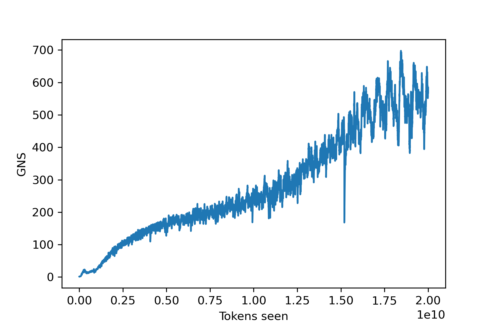

# OpenGNS

**An Open Dataset of the Gradient Noise Scale across Vision, Language, and Diffusion Models**

---

## Overview

The **Gradient Noise Scale (GNS)** measures the signal-to-noise ratio of gradients in stochastic gradient descent. As shown by McCandlish et al. (2018), it can approximate the **Critical Batch Size (CBS)** — the batch size at which scaling efficiency drops below a threshold — which is directly relevant to efficient distributed training of large models.

Despite the GNS appearing in technical reports of frontier models (e.g., GPT-3), no open dataset of GNS measurements across modern architectures existed. **OpenGNS** closes this gap.

We release over **400 training trajectories** spanning three domains, eleven model sizes, and dense batch-size/learning-rate grids, all trained under **Maximal Update Parameterization (muP)**. Alongside the dataset, we present an empirical study of how the GNS depends on hyperparameters, model scale, and training progress, and how it relates to the CBS.

---

## Dataset

The dataset is hosted on [Hugging Face](https://huggingface.co/datasets/olympique-marcel/OpenGNS) and split into one Parquet file per workload. In total there are **433 training runs**: 180 ResNet configurations, 178 GPT configurations, and 75 DiT configurations.

### Experimental Setup

| Hyperparameter | ResNet18 | GPT | DiT |
|---|---|---|---|
| Dataset | CIFAR-10 | FineWeb | ImageNet |
| Training data | 10M images | 20B tokens | 51M images |
| Validation data | 10,000 images | 100M tokens | 40,504 images |
| Model widths | [1×, 2×, 4×] | [256, 512, 1024, 2048, 2560] | [144, 288, 576] |
| Parameters | 11M, 45M, 179M | 22M, 64M, 203M, 707M, 1B | 11M, 43M, 169M |
| Batch sizes | 2⁵–2¹⁴ images | 2¹⁵–2²¹ tokens | 2⁶–2¹⁰ images |
| Learning rates | 10⁻⁵–10⁻¹ | 2⁻¹¹–2⁻⁶ | 2⁻¹³–2⁻⁹ |
| Optimizer | AdamW | AdamW | AdamW |
| LR schedule | Cosine (epoch) | Cosine (step) | Constant |

All models were trained on the **Leonardo Booster HPC** (NVIDIA A100 GPUs, InfiniBand interconnect), consuming approximately **200,000 GPU hours** in total.

### Files and Columns

**`cv.parquet`** — 11.2M rows, ResNet18 on CIFAR-10

| Column | Description |
|---|---|
| `iteration` | Training step |
| `gns` | Simplified gradient noise scale B_simple |
| `gns_norm` | Squared gradient norm \|G\|² |
| `gns_var` | Trace of per-example gradient covariance tr(Σ) |
| `train_loss` / `val_loss` / `test_loss` | Losses |
| `train_acc` / `val_acc` / `test_acc` | Accuracies |
| `width` | Model width multiplier (1, 2, 4) |
| `batch_size` | Global batch size (images) |
| `lr` | Learning rate |
| `samples_seen` | Total training samples processed |

**`nlp.parquet`** — 27.5M rows, GPT on FineWeb

| Column | Description |
|---|---|
| `iteration` | Training step |
| `gns` / `gns_norm` / `gns_var` | GNS and its components |
| `train/loss` / `val/loss` | Losses |
| `width` | Model width (256, 512, 1024, 2048, 2560) |
| `batch_size` | Global batch size (tokens) |
| `peak_lr` | Peak learning rate hyperparameter |
| `lr` | Instantaneous learning rate (varies with cosine schedule) |
| `lr_schedule` | LR schedule type (`cosine`) |
| `seed` | Random seed |
| `samples_seen` | Total training tokens processed |

**`diffusion.parquet`** — 265K rows, DiT on ImageNet

| Column | Description |
|---|---|
| `iteration` | Training step |
| `gns` / `gns_norm` / `gns_var` | GNS and its components |
| `train/loss` / `val/loss` | Losses on ImageNet |
| `coco_val/loss` | Validation loss on COCO |
| `heads` | Number of attention heads (model size identifier) |
| `log_lr` | Learning rate on log₂ scale |
| `batch_size` | Global batch size (images) |
| `samples_seen` | Total training images processed |

### GNS Columns Explained

Each row records three quantities that together define the GNS:

```
GNS (B_simple) = gns_var / gns_norm = tr(Σ) / |G|²
```

`gns` is the smoothed GNS estimate. `gns_norm` and `gns_var` are the raw components, released separately so users can reconstruct or study them independently.

---

## Quick Start

```python
import pandas as pd

# Load a dataset
cv   = pd.read_parquet("cv.parquet")        
nlp  = pd.read_parquet("nlp.parquet")
diff = pd.read_parquet("diffusion.parquet")

# Filter to a single run (model size + batch size + learning rate)
run = nlp[(nlp["width"] == 1024) & (nlp["batch_size"] == 2**20) & (nlp["peak_lr"] == 2**-7)]

# Plot GNS over training
import matplotlib.pyplot as plt
plt.plot(run["samples_seen"], run["gns"])
plt.xlabel("Tokens seen")
plt.ylabel("GNS")
plt.show()
```


---

## Repository Structure

```
OpenGNS/
└── plots/
    ├── cbs_gns_plots/              # GNS vs. Critical Batch Size plots
    │   ├── plot_CBS_GNS_joint_cv.ipynb
    │   ├── plot_CBS_GNS_joint_nlp.ipynb
    │   └── plot_CBS_GNS_joint_diffusion.ipynb
    ├── gns_plots/                  # GNS component analysis (NLP)
    │   ├── nlp_gns_dependency.ipynb
    │   └── nlp_gns_norm_var.ipynb
    └── temperature_comparison/     # GNS as temperature of training
        ├── cv_temperature_comparison.ipynb
        ├── nlp_temperature_comparison.ipynb
        └── diffusion_temperature_comparison.ipynb
```

---

## References

McCandlish et al. (2018). *An Empirical Model of Large-Batch Training.*  
Yang et al. (2021). *Tuning Large Neural Networks via Zero-Shot Hyperparameter Transfer (muP).* NeurIPS.  
Zhang et al. (2024). *How Does Critical Batch Size Scale in Pre-Training?* OPT Workshop.
